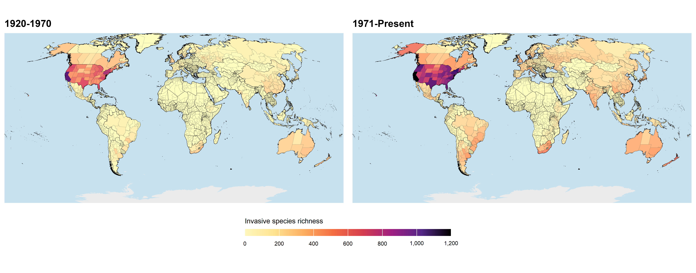
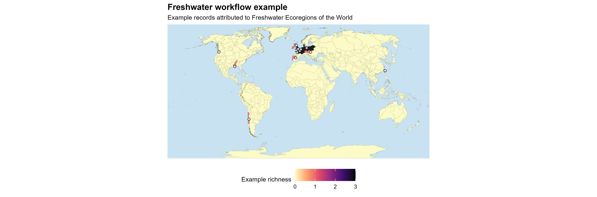
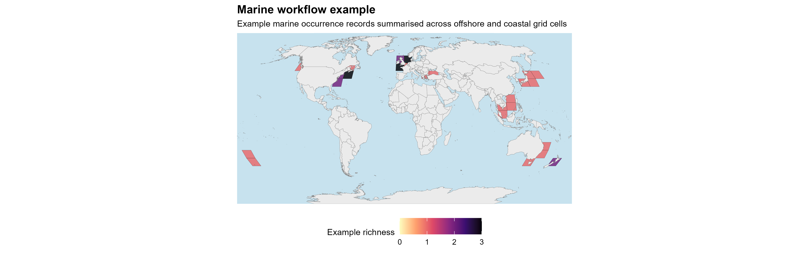

# biofetchR

`biofetchR` is an R package for building reproducible biodiversity
occurrence-data workflows. It helps users download, clean, classify,
enrich, audit and export occurrence records for ecological,
macroecological and invasion-biology analyses.

The package is designed around GBIF-based occurrence processing, with
workflows for terrestrial, freshwater and marine systems. It is
especially useful for projects that need to process many species,
countries or species-country combinations in a consistent way, while
retaining clear audit trails for taxonomic resolution, coordinate
filtering, spatial attribution, native-range evidence and
invasion-status classification.

`biofetchR` links occurrence records to biologically, environmentally
and geographically meaningful spatial contexts. These include
administrative units, freshwater basins and ecoregions, protected-area
layers, terrestrial ecoregions, marine regions, EEZ-style units and
marine ecoregional overlays. It also supports native-range and
invasion-status evidence from sources such as GBIF, WoRMS, SInAS and
GRIIS, helping users distinguish native, non-native and invasive records
where supporting evidence is available.

`biofetchR` is not a plotting package. The figures below illustrate
examples of spatial summaries that can be produced from `biofetchR`
outputs using standard R spatial and visualisation tools such as `sf`,
`dplyr` and `ggplot2`.

## Visual workflow examples

### Terrestrial occurrence workflows



The terrestrial workflow focuses on assigning cleaned GBIF records to
land-based spatial units. Users can summarise records by administrative
boundaries, terrestrial ecoregions, protected areas and other
landscape-context layers, depending on the spatial question being asked.

The example above shows invasive species richness summarised across
subnational administrative units. In this case, `biofetchR` provides the
cleaned and spatially attributed occurrence table; the map is then
produced separately from that output.

Typical terrestrial use cases include:

- assigning occurrence records to GADM administrative units;
- summarising records by country, region or subnational unit;
- comparing records with terrestrial ecoregions or protected-area
  layers;
- preparing cleaned terrestrial occurrence tables for macroecological,
  conservation or invasion-biology analyses.

### Freshwater occurrence workflows



Freshwater workflows focus on occurrence records whose ecological
context is best described by inland-water systems, including rivers,
lakes, reservoirs, wetlands, catchments and freshwater ecoregions. In
`biofetchR`, occurrence records can be attributed to freshwater
ecoregions, basins, river and lake layers, reservoirs, wetlands, Ramsar
sites and related hydrological overlays.

The example above summarises occurrence records against Freshwater
Ecoregions of the World (FEOW). This is useful when the main question
concerns drainage systems, freshwater biogeographic units, catchments or
inland-water habitats, rather than broader terrestrial landscape
contexts.

Typical freshwater use cases include:

- assigning records to Freshwater Ecoregions of the World (FEOW);
- summarising occurrences across basins, rivers, lakes or reservoirs;
- linking records to wetland and Ramsar-site contexts;
- identifying records that require freshwater-specific spatial
  interpretation;
- preparing freshwater occurrence tables for analyses of species
  distributions, biological invasions, conservation priorities or
  invasion impacts.

### Marine occurrence workflows



Marine workflows are designed to retain and interpret coastal, island
and offshore records that may be excluded, misclassified or poorly
summarised by land-focused occurrence workflows. In `biofetchR`, these
records can be assigned to supported marine layers including EEZ-style
units, Marine Regions products, IHO sea areas, Marine Ecoregions of the
World and Large Marine Ecosystem (LME) polygons.

The example above shows marine records summarised across offshore and
coastal grid cells. This provides a simple visual summary of where
records occur, while the same workflow can also be used with named
marine overlays when the question concerns jurisdictions, ecoregions,
seas, shelves, islands, ports or other coastal and ocean contexts.

Typical marine use cases include:

- retaining valid offshore records during occurrence processing;
- assigning records to EEZ-style units or other marine jurisdictional
  layers;
- summarising records by marine ecoregion, Large Marine Ecosystem or
  named sea area;
- distinguishing coastal, island and open-water records from terrestrial
  spatial attribution;
- preparing marine occurrence tables for biodiversity, biogeographic or
  biological-invasion analyses.

## What biofetchR does

`biofetchR` is built around input tables that define the taxa and places
to be processed, usually with one row per species-country combination
and columns such as `species` and `iso2c`. For each row, the package can
request matching GBIF occurrence records, import the completed download,
clean and standardise the records, attach spatial context, add
native-range or invasion-status evidence, and write processed outputs
with diagnostic summaries.

Core workflow steps include:

- reading an input table of species-country combinations, usually with
  `species` and `iso2c` columns;
- resolving taxonomic names and GBIF taxon keys before downloads are
  submitted;
- requesting and importing GBIF occurrence records for each input row;
- standardising the returned records into consistent output tables;
- applying coordinate-cleaning and optional spatial-thinning steps;
- assigning records to the selected terrestrial, freshwater or marine
  workflow;
- adding origin and invasion-status evidence where supported by the
  selected settings;
- writing processed records, summaries and diagnostic files that
  document what happened during the run;
- optionally saving separate output files for individual species-country
  combinations when large datasets need to be split into smaller files.

`biofetchR` keeps the main processing decisions visible. During a run,
users can inspect how many records were returned, which records were
removed during cleaning, where spatial joins succeeded or failed, and
which evidence sources were used when assigning native, introduced or
invasive status.

The resulting outputs are designed to be checked before analysis, rather
than accepted as a single final table. This makes them suitable for
biodiversity, macroecological, conservation and invasion-biology
projects where occurrence records need to be cleaned, spatially
attributed and interpreted consistently across many taxa or regions.

## Installation

Install `biofetchR` outside package checks, following the installation
instructions provided with the source repository.

Then load the package:

``` r
library(biofetchR)
```

## Workflow summary

Most `biofetchR` workflows start from an input table of species-country
combinations, usually with `species` and `iso2c` columns. Each row is
treated as a processing unit: the package resolves the taxon, requests
or reads the matching GBIF records for that country, applies the
selected cleaning and spatial steps, and writes outputs to the chosen
folder.

| Workflow | Use when | Main output |
|----|----|----|
| Terrestrial | Records need to be interpreted using land-based boundaries or landscape-context layers | Cleaned occurrence records joined to the selected terrestrial overlays |
| Freshwater | Records are associated with inland-water systems or freshwater biogeographic units | Cleaned occurrence records joined to the selected freshwater overlays |
| Marine | Records are coastal, island-associated or offshore | Cleaned occurrence records joined to the selected marine overlays |
| Origin and status evidence | A workflow needs native-range, introduced-status or invasive-status information | Evidence fields that help interpret species-country origin and invasion status |
| Export options | Results need to be inspected, reused or split across a large batch | Combined outputs, diagnostic summaries and optional per-species-country files |

These workflow components can be used separately or combined. For
example, a species-country table can be processed through the
terrestrial workflow, enriched with origin and status evidence, and
exported either as one combined table or as separate files for each
species-country combination.

The choice of workflow depends on the study system and the spatial
question. A terrestrial analysis may require administrative units, a
freshwater analysis may require hydrological context, and a marine
analysis may require offshore or jurisdictional marine layers. The
sections below show these options in more detail.

## Terrestrial and freshwater workflows

Terrestrial and freshwater workflows usually start from a
species-country input table. The simplest format is one row per
species-country combination, with a `species` column and an ISO2 country
code in `iso2c`.

``` r
terrestrial_input <- data.frame(
  species = c(
    "Xenopus laevis",
    "Trachemys scripta"
  ),
  iso2c = c(
    "FR",
    "GB"
  ),
  stringsAsFactors = FALSE
)

terrestrial_input
#>             species iso2c
#> 1    Xenopus laevis    FR
#> 2 Trachemys scripta    GB
```

The terrestrial example below requests GBIF records for each
species-country combination, applies the selected cleaning and thinning
settings, and assigns retained records to GADM level-1 administrative
units.

``` r
result <- process_gbif_terrestrial_freshwater_pipeline(
  # Input table with one row per species-country combination.
  df = terrestrial_input,

  # Folder where processed records, summaries and diagnostics will be written.
  output_dir = file.path(example_output_root, "terrestrial_gadm"),

  # GBIF credentials. These are best stored as environment variables.
  user = Sys.getenv("GBIF_USER"),
  pwd = Sys.getenv("GBIF_PWD"),
  email = Sys.getenv("GBIF_EMAIL"),

  # Spatial overlay settings. Here, records are joined to GADM level-1 units.
  region_source = "gadm",
  gadm_unit = 1,

  # Record-cleaning settings.
  apply_cleaning = TRUE,
  apply_thinning = TRUE,
  dist_km = 5,

  # Output settings. For larger batches, write results to disk instead of
  # keeping all records in memory.
  export_summary = TRUE,
  store_in_memory = FALSE,
  return_all_results = FALSE
)
```

For freshwater analyses, the same input table can be processed with a
freshwater-specific `region_source`. In this example, records are
assigned to Freshwater Ecoregions of the World (FEOW).

``` r
freshwater_result <- process_gbif_terrestrial_freshwater_pipeline(
  df = terrestrial_input,

  output_dir = file.path(example_output_root, "freshwater_feow"),

  user = Sys.getenv("GBIF_USER"),
  pwd = Sys.getenv("GBIF_PWD"),
  email = Sys.getenv("GBIF_EMAIL"),

  # Use a freshwater overlay instead of an administrative boundary.
  region_source = "feow",

  apply_cleaning = TRUE,
  apply_thinning = TRUE,
  dist_km = 5,

  export_summary = TRUE,
  store_in_memory = FALSE,
  return_all_results = FALSE
)
```

``` r
freshwater_result <- process_gbif_terrestrial_freshwater_pipeline(
  df = terrestrial_input,

  output_dir = file.path(example_output_root, "freshwater_feow"),

  user = Sys.getenv("GBIF_USER"),
  pwd = Sys.getenv("GBIF_PWD"),
  email = Sys.getenv("GBIF_EMAIL"),

  # Use a freshwater overlay instead of an administrative boundary.
  region_source = "feow",

  apply_cleaning = TRUE,
  apply_thinning = TRUE,
  dist_km = 5,

  export_summary = TRUE,
  store_in_memory = FALSE,
  return_all_results = FALSE
)
```

For larger batches, `store_in_memory = FALSE` writes results to the
output folder instead of holding them as one large R object. This is
useful when users want outputs saved separately for individual
species-country combinations.

## Marine workflows

Marine workflows use a separate pipeline for coastal, offshore and other
marine occurrence records. Unlike the terrestrial and freshwater
examples above, the marine input can be a species table without a
country column.

``` r
marine_input <- data.frame(
  species = c(
    "Carcinus maenas",
    "Undaria pinnatifida"
  ),
  stringsAsFactors = FALSE
)

marine_input
#>               species
#> 1     Carcinus maenas
#> 2 Undaria pinnatifida
```

The example below assigns marine occurrence records to EEZ-style
polygons. Other supported marine overlays can be selected by changing
the `overlay` argument.

``` r
marine_result <- process_gbif_marine_pipeline(
  df = marine_input,

  output_dir = file.path(example_output_root, "marine_eez"),

  user = Sys.getenv("GBIF_USER"),
  pwd = Sys.getenv("GBIF_PWD"),
  email = Sys.getenv("GBIF_EMAIL"),

  # Choose the marine overlay used for spatial attribution.
  overlay = "eez",
  overlay_cache_dir = file.path(example_cache_root, "marine_overlays"),

  apply_cleaning = TRUE,
  apply_thinning = TRUE,
  dist_km = 5,

  export_summary = TRUE,
  store_in_memory = FALSE,
  return_all_results = FALSE
)
```

Choose the marine overlay according to the spatial question. EEZ-style
layers are useful for jurisdictional marine areas, Large Marine
Ecosystem (LME) polygons for broad ecosystem regions, MEOW for coastal
marine biogeography, and IHO sea areas for named seas or hydrographic
regions.

## Origin and invasive-status evidence

`biofetchR` can add origin and invasive-status fields to processed
occurrence outputs before users decide whether to filter records. This
separates occurrence processing from biological interpretation: a record
can be cleaned and spatially attributed first, then assessed using the
available evidence for whether the species is native, introduced,
invasive or unresolved in that location.

The evidence sources used depend on the workflow and settings selected.
GBIF, WoRMS and SInAS can contribute native-range or origin information,
while GRIIS-style species-country records can support introduced or
invasive-status classification. Because these sources differ in
coverage, terminology and spatial resolution, `biofetchR` treats them as
evidence fields that can be inspected rather than as a single automatic
decision.

``` r
origin_result <- process_gbif_terrestrial_freshwater_pipeline(
  df = terrestrial_input,

  output_dir = file.path(example_output_root, "terrestrial_origin_audit"),

  user = Sys.getenv("GBIF_USER"),
  pwd = Sys.getenv("GBIF_PWD"),
  email = Sys.getenv("GBIF_EMAIL"),

  region_source = "gadm",
  gadm_unit = 1,

  # Add GRIIS-style introduced or invasive-status evidence, but do not
  # restrict the first run to invasive-only records.
  use_griis = TRUE,
  filter_griis_invasive = FALSE,

  # Add native-range evidence and export it for inspection.
  use_native_range = TRUE,
  use_native_web = TRUE,
  native_web_sources = c("sinas", "gbif"),
  native_filter_mode = "audit_only",

  # Combine available origin/status fields into a clearer audit output.
  reconcile_origin_evidence = TRUE,
  export_origin_audit = TRUE,

  apply_cleaning = TRUE,
  apply_thinning = TRUE,
  dist_km = 5,

  export_summary = TRUE,
  store_in_memory = FALSE,
  return_all_results = FALSE
)
```

In this example, the first run is evidence-based rather than
filter-first. GRIIS-style information is attached, native-range evidence
is queried, and the combined origin/status fields are exported for
review. This lets users check which species-country combinations have
consistent, conflicting or unresolved evidence before applying stricter
filtering rules.

Typical origin and status use cases include:

- checking whether records occur inside or outside available
  native-range evidence;
- comparing origin/status fields from different sources;
- identifying species-country combinations with uncertain or conflicting
  classifications;
- exporting an origin-evidence table before removing records;
- deciding whether an analysis should retain all records, introduced
  records, invasive records or a more conservative subset.

For publication-facing workflows, users should report which evidence
sources were used, whether they were used for inspection or filtering,
and how uncertain or conflicting classifications were handled.

## Outputs and diagnostics

Most high-level `biofetchR` workflows write a `gbif_summary.csv` file to
the selected `output_dir`. This file gives a row-by-row overview of the
run, including which species-country combinations succeeded, which
failed or returned no records, how many records were retained after
processing, and where the exported files were saved.

The summary file is the best place to start after a batch run. It helps
users spot failed downloads, missing output files, unexpectedly low
record retention, or large differences between raw, cleaned and thinned
record counts without opening every occurrence table individually.

Common `gbif_summary.csv` fields include:

| Field | Meaning |
|----|----|
| `species` | Species name processed by the workflow |
| `status` | Whether the row succeeded, failed, returned no records or was skipped |
| `fail_stage` | Processing step where a failure occurred, where relevant |
| `fail_reason` | Short explanation of the failure or issue |
| `n_total` | Number of records returned before cleaning |
| `n_cleaned` | Number of records retained after coordinate cleaning |
| `n_thinned` | Number of records retained after optional spatial thinning |
| `output_file` | Path to the exported occurrence file for that row |
| `download_key` | GBIF download key, where available |
| `doi` | GBIF download DOI, where available |
| `region_source` | Spatial overlay used for attribution |
| `gadm_unit` | GADM administrative level, where relevant |
| `notes` | Additional processing notes, where generated |

For larger analyses, useful files to keep include the original input
table, `gbif_summary.csv`, exported occurrence files, origin-evidence
outputs, spatial-attribution diagnostics, failed-row logs, GBIF download
keys or DOIs, overlay-source metadata and `sessionInfo()` output.

A simple output folder might look like this:

``` text
outputs/
├── gbif_summary.csv
├── occurrence_files/
│   ├── Xenopus_laevis_FR.csv
│   └── Trachemys_scripta_GB.csv
├── audits/
│   ├── origin_evidence_audit.csv
│   ├── spatial_attribution_audit.csv
│   └── failed_rows.csv
├── cache/
│   ├── gbif/
│   └── spatial_overlays/
└── sessionInfo.txt
```

These files make the processing history easier to check and reuse. They
show which input rows were processed, which records were retained or
removed, which spatial layers were applied, and which origin or
invasive-status evidence was attached. For publication-facing analyses,
they should be kept with the main analysis outputs rather than treated
as temporary files.

## Recommended user guides

The package includes user guides for the main `biofetchR` workflows.
These are best used as worked examples: they show how to structure
inputs, choose settings, run pipelines and inspect the files written to
the output folder.

| Guide | File | Start here when you want to… |
|----|----|----|
| Batch pipelines | `biofetchR-batch-pipelines.Rmd` | run terrestrial or freshwater GBIF workflows for species-country tables |
| Origin evidence | `biofetchR-origin-evidence.Rmd` | add native-range, introduced-status or invasive-status evidence |
| Spatial overlays | `biofetchR-spatial-overlays.Rmd` | join cleaned records to administrative, ecological or contextual layers |
| Marine workflows | `biofetchR-marine-workflows.Rmd` | process coastal and offshore records with marine-region overlays |
| Auditing and scaling | `biofetchR-auditing-and-scaling.Rmd` | inspect outputs, diagnose failed rows and manage larger batches |

New users should usually begin with the batch-pipelines guide, because
it introduces the standard species-country input format and the main
terrestrial and freshwater pipeline. The origin-evidence and
spatial-overlays guides can then be used when a workflow needs
biological status fields or additional spatial context. The marine guide
covers the separate marine pipeline, and the auditing-and-scaling guide
is useful before running larger input tables.

After installing `biofetchR`, all guides can be opened from R with:

``` r
browseVignettes("biofetchR")
```

Individual guides can also be opened directly:

``` r
vignette("biofetchR-batch-pipelines", package = "biofetchR")
vignette("biofetchR-origin-evidence", package = "biofetchR")
vignette("biofetchR-spatial-overlays", package = "biofetchR")
vignette("biofetchR-marine-workflows", package = "biofetchR")
vignette("biofetchR-auditing-and-scaling", package = "biofetchR")
```

Function-level help is available through the usual R help system:

``` r
?process_gbif_terrestrial_freshwater_pipeline
?process_gbif_marine_pipeline
```

## Optional workflow dependencies

Most packages needed for standard `biofetchR` workflows are installed
with the package. A smaller number of packages are only needed for
particular features, such as raster-based overlays, geometry repair,
OpenStreetMap layers, Natural Earth helpers or WoRMS queries.

These packages are treated as optional because not every user will need
every provider or spatial-data source. For example, a basic GBIF
occurrence workflow does not necessarily require packages used for
raster layers, marine-origin lookups or OpenStreetMap-derived context.

If a selected workflow needs an optional package that is not installed,
`biofetchR` will report the missing package. Install it, then rerun the
workflow.

``` r
biofetchR::install_optional_deps()
#>               package                                         purpose available
#> 1           geosphere     Distance calculations and spatial utilities      TRUE
#> 2             ggplot2          Plotting examples and visual summaries      TRUE
#> 3                httr        HTTP requests for optional web workflows      TRUE
#> 4              lwgeom Geometry repair and advanced spatial operations      TRUE
#> 5  mapme.biodiversity            Optional biodiversity context layers      TRUE
#> 6             osmdata         OpenStreetMap-based contextual overlays      TRUE
#> 7              readxl                      Reading spreadsheet inputs      TRUE
#> 8       rnaturalearth               Natural Earth contextual overlays      TRUE
#> 9             stringi                       String encoding utilities      TRUE
#> 10            stringr                   String manipulation utilities      TRUE
#> 11              terra                        Raster context workflows      TRUE
#> 12              tidyr                        Data reshaping utilities      TRUE
#> 13             worrms      World Register of Marine Species workflows      TRUE
```

Common optional packages include:

| Package         | Used for                                                 |
|-----------------|----------------------------------------------------------|
| `terra`         | Raster-based layers and selected spatial-data operations |
| `lwgeom`        | Geometry repair and additional `sf` geometry operations  |
| `osmdata`       | OpenStreetMap-derived contextual layers                  |
| `rnaturalearth` | Natural Earth country, land and boundary layers          |
| `worrms`        | WoRMS taxonomic or marine-origin lookups                 |

Some external spatial resources are large, provider-dependent or updated
outside the package. These files may be downloaded during a workflow,
stored in a local cache, or supplied by the user when a provider source
is unavailable.

For larger or repeatable analyses, it is useful to define cache folders
explicitly. This avoids repeated downloads and makes it easier to reuse
the same overlay files across runs.

``` r
dir.create(example_cache_root, recursive = TRUE, showWarnings = FALSE)
dir.create(file.path(example_cache_root, "spatial_overlays"), recursive = TRUE, showWarnings = FALSE)
dir.create(file.path(example_cache_root, "marine_overlays"), recursive = TRUE, showWarnings = FALSE)
dir.create(file.path(example_cache_root, "native_range"), recursive = TRUE, showWarnings = FALSE)
```

Users should also keep a record of the package versions and external
resources used in an analysis. At minimum, save `sessionInfo()` with the
output folder and keep any overlay metadata or provider notes alongside
the processed occurrence files.

``` r
writeLines(
  capture.output(sessionInfo()),
  file.path(example_output_root, "sessionInfo.txt")
)
```

## Reproducibility

Reproducibility is central to `biofetchR` workflows. Occurrence datasets
can change through time, spatial products can be updated, and cleaning
or filtering settings can strongly affect the final records retained for
analysis. For this reason, users should treat the exported occurrence
tables and audit files as part of the analysis record, not as temporary
intermediate files.

For publication-facing analyses, users should report:

- GBIF download DOI or download key;
- date of occurrence download or data access;
- input species list and country or region fields used;
- spatial overlay source, product name, version and access date;
- coordinate-cleaning settings;
- spatial-thinning settings and thinning distance, if thinning was used;
- terrestrial, freshwater or marine spatial unit used for attribution;
- origin-evidence sources and whether they were used for audit or
  filtering;
- native-range or invasive-status filtering settings, if applied;
- package version;
- R version and session information.

A minimal reproducibility record can be saved with:

``` r
writeLines(
  capture.output(sessionInfo()),
  file.path(example_output_root, "sessionInfo.txt")
)
```

For larger analyses, users should also keep a copy of the exact input
table and the main workflow summary file:

``` r
dir.create(file.path(example_output_root, "reproducibility"), recursive = TRUE, showWarnings = FALSE)

file.copy(
  from = "input_species_list.csv",
  to = "outputs/reproducibility/input_species_list.csv",
  overwrite = TRUE
)

file.copy(
  from = "outputs/gbif_summary.csv",
  to = "outputs/reproducibility/gbif_summary.csv",
  overwrite = TRUE
)
```

When external spatial overlays are used, the source and version should
be recorded alongside the output files. This is important because
administrative boundaries, protected-area layers, freshwater datasets
and marine-region products may be revised over time.

``` r
overlay_metadata <- data.frame(
  overlay_name = c("GADM", "FEOW", "Marine Regions"),
  product = c("Administrative boundaries", "Freshwater ecoregions", "Marine overlay"),
  version = c("record_version_here", "record_version_here", "record_version_here"),
  access_date = as.character(Sys.Date()),
  source_url = c("record_url_here", "record_url_here", "record_url_here"),
  stringsAsFactors = FALSE
)

write.csv(
  overlay_metadata,
  file = "outputs/reproducibility/spatial_overlay_metadata.csv",
  row.names = FALSE
)
```

The aim is that another user, or the same user later, can reconstruct
which records were downloaded, which records were removed, which spatial
units were used, which evidence sources were applied, and which settings
produced the final analysis-ready dataset.

## Reproducibility

`biofetchR` outputs are designed to be kept with the analysis they
support. A completed GBIF download can be linked back to its download
key and DOI where available, while the package version and selected
workflow settings show how the downloaded records were cleaned,
filtered, spatially attributed and interpreted.

Rerunning the same species-country query later may create a new GBIF
download if the workflow is submitted again. For this reason, users
should keep the download key or DOI from the original run rather than
relying only on the query that generated it.

For spatial attribution, users should record the workflow type and
overlay used. For package-managed overlays, the `biofetchR` version is
usually the most important reference point. If external, cached or
user-supplied spatial files are used, any available source, version and
access-date metadata should also be kept with the outputs.

For publication-facing analyses, useful details to report include:

| Item | What to record |
|----|----|
| Input data | Input table, species names and country or region fields used |
| GBIF data | Download key, DOI where available and download or access date |
| Cleaning | Coordinate-cleaning settings and record filters applied |
| Thinning | Whether thinning was used and the thinning distance |
| Spatial attribution | Workflow type, selected overlay and relevant overlay settings |
| Origin/status evidence | Evidence sources used and whether they were used for audit or filtering |
| External resources | Source, version or access-date metadata for cached or user-supplied files |
| Software | `biofetchR` version, R version and package session information |

A minimal reproducibility folder can be created inside the output
directory:

``` r
dir.create(file.path(example_output_root, "reproducibility"), recursive = TRUE, showWarnings = FALSE)

writeLines(
  capture.output(sessionInfo()),
  file.path(example_output_root, "reproducibility", "sessionInfo.txt")
)
```

Users should also keep the original input table and the main workflow
summary. Together, these files show what was submitted to the workflow
and what happened to each input row.

``` r
file.copy(
  from = "input_species_list.csv",
  to = file.path(example_output_root, "reproducibility", "input_species_list.csv"),
  overwrite = TRUE
)

file.copy(
  from = file.path(example_output_root, "gbif_summary.csv"),
  to = file.path(example_output_root, "reproducibility", "gbif_summary.csv"),
  overwrite = TRUE
)
```

When external or user-supplied overlays are used, a small metadata table
can be saved alongside the processed occurrence files.

``` r
overlay_metadata <- data.frame(
  overlay_name = c("custom_overlay_name"),
  source = c("record_source_here"),
  version = c("record_version_here"),
  access_date = as.character(Sys.Date()),
  notes = c("record_any_relevant_processing_or_cache_notes_here"),
  stringsAsFactors = FALSE
)

write.csv(
  overlay_metadata,
  file = file.path(
    "outputs",
    "reproducibility",
    "external_overlay_metadata.csv"
  ),
  row.names = FALSE
)
```

These records make it easier to rerun the workflow, explain why records
were retained or removed, identify which spatial settings were used, and
describe how native-range or invasive-status evidence was handled.

## README figures

The figures in this README are static PNG files stored in
`man/figures/`:

``` text
man/figures/readme-terrestrial-richness.png
man/figures/readme-freshwater-feow.png
man/figures/readme-marine-regions.png
```

They are included to show examples of the spatial summaries that can be
produced after running `biofetchR` workflows. The package itself does
not provide plotting functions. Instead, it writes processed occurrence
tables that users can map with standard R tools such as `sf`, `ggplot2`,
`terra` or other spatial-visualisation packages.

Using static images keeps the README fast to render and easy to view on
GitHub. It also avoids rerunning GBIF downloads, loading large spatial
overlays or querying external providers each time the README is built.

The figure files can be regenerated during package development using
scripts in:

``` text
dev/readme_figures/
```

These scripts are separate from the exported package functions. They are
used only to prepare the README images and may depend on local example
data, cached spatial layers or other development files.

To update the README figures, regenerate or replace the PNG files in
`man/figures/`, then rerender the README:

``` r
rmarkdown::render("README.Rmd")
```

If the README is rendered before the PNG files are available, the figure
panels should be checked carefully before committing the updated README.
The static image files should be committed with the README so that users
can view the figures without running the development scripts.

## Citation

When using `biofetchR`, cite the package and the data sources that
contributed to the final dataset. `biofetchR` should be cited for the
workflow used to download, clean, classify, enrich and export occurrence
records, while external providers should be cited for the occurrence,
taxonomic, spatial or status evidence used in the analysis.

For the package itself, cite the version, release or repository commit
used in the analysis. Where available, the package citation can be
checked from R:

``` r
citation("biofetchR")
```

GBIF-mediated occurrence records should be cited using the GBIF download
DOI created for the download used in the analysis. The DOI identifies
the downloaded dataset and gives credit to the underlying data
publishers. Users do not need to cite each individual occurrence record
separately. If a DOI is not available, retain and report the GBIF
download key.

Cite external providers only when they were actually used in the
workflow. For example, a terrestrial workflow may require a GBIF
download DOI and a citation for the boundary layer used for spatial
attribution. A marine workflow may also require citation of Marine
Regions, WoRMS or another marine data provider. A workflow using
native-range or invasive-status evidence should cite the relevant
evidence source separately.

Useful citation details include:

| Resource | What to cite |
|----|----|
| `biofetchR` | Package version, release or repository commit |
| GBIF occurrence records | GBIF download DOI, or download key if a DOI is unavailable |
| Spatial overlays | Product name, provider, version and access date where relevant |
| Taxonomic services | Source used for taxonomic matching or validation |
| Origin/status evidence | Native-range, introduced-status or invasive-status evidence source |
| Custom data | Any user-supplied occurrence tables or spatial layers used in the workflow |

A publication-facing citation record might include:

``` text
biofetchR package version or repository commit
GBIF download DOI for occurrence records
Spatial overlay product used for attribution
Taxonomic or marine-origin provider, where applicable
Native-range or invasive-status evidence source, where applicable
```

Users should avoid citing only `biofetchR` when the analysis also
depends on external occurrence records, spatial products or evidence
sources. The clearest approach is to cite `biofetchR` for the processing
workflow and cite each underlying provider for the data used to build
the final dataset.

## Package status

`biofetchR` is a developing research software package for biodiversity
occurrence-data workflows. The core terrestrial, freshwater, marine,
origin evidence and export workflows are being refined through continued
testing across additional taxa, regions and spatial data sources.

Future updates may expand spatial-overlay support, improve diagnostics,
add new provider options and incorporate additional databases for
assessing non-native or invasive status. These additions will build on
the existing evidence-based approach, where external sources are used to
support interpretation rather than being treated as a single definitive
classification.

Users running larger analyses should record the package version or
repository commit used, especially when results need to be reproduced
later.

``` r
packageVersion("biofetchR")
```

Before rerunning an older analysis with a newer version of the package,
users should check whether any relevant arguments, defaults, provider
requirements, evidence sources or output formats have changed.
